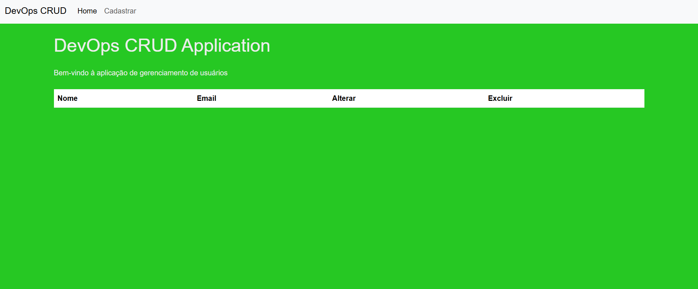

# Sistema-Cadastro-Usuario

Sistema completo para cadastro de usuários, com front-end em **Next.js**, back-end em **NestJS**, documentação com **Swagger**, persistência de dados em **MySQL** e uso do **TypeORM** como ORM.

---

## 📌 Objetivo

Permitir o cadastro de usuários com **e-mail** e **nome**, armazenando os dados com segurança no banco de dados e disponibilizando uma API documentada com Swagger para facilitar o consumo dos endpoints.

---

## 🛠️ Tecnologias Utilizadas

### 🧩 Front-end (pasta `frontend`)
- Next.js
- React
- TypeScript
- Axios (para requisições HTTP)

### 🔧 Back-end (pasta `backend`)
- NestJS
- TypeScript
- TypeORM
- MySQL
- Swagger
- Dotenv

---

## 📁 Estrutura do Projeto
### Frontend
```bash
Sistema-Cadastro-Usuario/
├── Frontend/ # Projeto Next.js
 ├── src/
│   ├── app/
│   │   ├── cadastrar/
│   │   │   ├── page.tsx         # Página de cadastro
│   │   │   └── cadastrar.module.css  # (opcional) Estilo específico da página
│   │   ├── layout.tsx           # Layout geral
│   │   ├── page.tsx             # Página inicial (ex: login ou home)
│   │   └── globals.css          # Estilos globais
│   ├── components/
│   │   ├── FormCadastro.tsx     # Componente reutilizável de formulário
│   │   ├── Input.tsx            # Componente de input (email, senha, etc.)
│   │   ├── Button.tsx           # Componente de botão
│   │   └── ...outros componentes
├── public/
│   └── favicon.ico
├── next.config.js
├── tsconfig.json
├── package.json
```

### Backend

 ```bash
 Sistema-Cadastro-Usuario/
 ├── backend/ # Projeto Next.js
 ├── src/
 │   ├── Controller/       # Controladores (rotas)
 │   ├── model/            # Entidades ou interfaces de dados
 │   ├── Module/           # Módulos do sistema
 │   ├── Service/          # Regras de negócio
 │   ├── app.module.ts     # Módulo principal da aplicação
 │   ├── main.ts           # Arquivo de bootstrap do NestJS
 │   └── ...configs

```
## 📁 Como baixar e rodar o projeto
### Baixar o projeto
```bash
  git clone https://github.com/MIcaelFone/Sistema-Cadastro-Usuario.git
```
### Frontend

#### Entrar na pasta Frontend
```bash
  cd Frontend 
```
#### Rodando o Frontend
<p> Siga os passos abaixo para instalar as dependências e iniciar o servidor:</p>

```bash
  npm i
  npm run dev
```


### Backend

#### Entrar na pasta Backend
```bash
  cd Backend
```
 #### Rodando o Backend
 <p> Siga os passos abaixo para instalar as dependências e iniciar o servidor:</p>
 
```bash   
  npm i
  npm run dev
```
## Como configurar o Banco de Dados
<p>Crie um arquivo .env para configurar o seu BD na raiz do pasta Backend</p>

```env
# Banco de Dados MySQL
DB_HOST=seuuserhost
DB_PORT=portadoseuBDusada
DB_USER=userdoseuBD
DB_PASSWORD=suasenha
DB_NAME=nomedoseudatabase
```
## Tela do sistema
#### Tela da Home
</img>
#### Tela do Formulário
</img>
